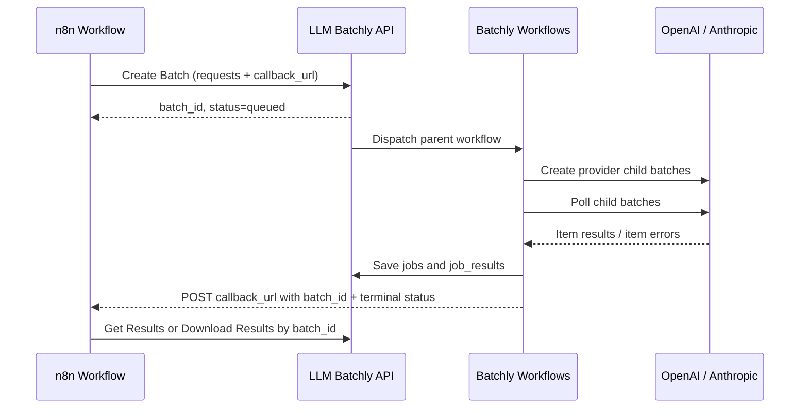

# n8n-nodes-llm-batchly

LLM Batchly community node for n8n. It creates async LLM batches through the public Batchly API and is designed around the standard Wait node resume pattern.

## Supported operations

- `Create Batch` → `POST /api/v1/batches`
- `Get Batch` → `GET /api/v1/batches/{batch_id}`
- `Get Results` → `GET /api/v1/batches/{batch_id}/results`
- `Download Results` → `GET /api/v1/batches/{batch_id}/download`
- Model catalog → `GET /api/v1/model-catalog`
- Providers: `openai`, `anthropic`, `gemini`

## Credentials

Create an `LLM Batchly API` credential with:

- `Base URL`: `https://app.llmbatch.ly` for production, or another Batchly API origin you operate
- `API Key`: a public API key created in the Batchly dashboard

The node sends the API key as the `x-api-key` header.

## Install on self-hosted n8n

From this repository:

```bash
pnpm install --frozen-lockfile
pnpm run build
mkdir -p ~/.n8n/nodes
cd ~/.n8n/nodes
npm install /path/to/n8n-nodes-llm-batchly
```

Or install the published package after it is available on npm:

```bash
npm install n8n-nodes-llm-batchly
```

Restart n8n after installation.

## Usage

### How n8n and Batchly work together



Batchly owns provider submission, polling, result normalization, and failed-item redrive. n8n owns workflow orchestration: create a batch, wait for the callback, fetch results, and branch on each item status.

The node supports two payload modes:

1. `Node Parameters`
   - Set `Provider`, choose a `Model` from the live Batchly model catalog, set `Callback URL`, and enter `Requests JSON` directly in the node.
   - Use `Model Source = Custom` only when you intentionally need to type a model name that is not yet listed.
   - Use the default `Callback URL` expression `{{$execution.resumeUrl}}` when you want a Wait node to resume automatically.
   - Put provider-specific fields such as `temperature`, `top_p`, or test-only mock controls inside each request's `provider_params` object.
2. `Incoming Item JSON`
   - Pass a complete request body from an upstream Set or Code node.
   - The current item's `json` object must already be the full snake_case API body and is sent to Batchly as-is.

### Requests JSON example

```json
[
  {
    "custom_id": "request-001",
    "messages": [
      {
        "role": "system",
        "content": "You are a concise support analyst."
      },
      {
        "role": "user",
        "content": [
          {
            "type": "text",
            "text": "Summarize this support ticket."
          }
        ]
      }
    ],
    "max_output_tokens": 512,
    "provider_params": {
      "temperature": 0
    }
  }
]
```

The public API is snake_case. Request items use `custom_id`, `messages`,
`tools`, `tool_choice`, `response_format`, `max_output_tokens`, and
`provider_params`. Legacy `customId`, `input`, `systemPrompt`, and
`outputSchema` fields are rejected by the API and by this node.

`provider_params` is merged into the provider request body after Batchly's
first-class fields. Prefer first-class fields for `tools`, `tool_choice`,
`response_format`, and `max_output_tokens`; use `provider_params` for fields
that are provider-specific and not modeled by Batchly yet.

OpenAI native batches are sent through the Responses API. Anthropic native
batches use Anthropic `output_config.format`. In the node UI, use
`Additional Options` → `Structured Output` for the common cases; use
`Response Format (JSON)` only when you need to pass the raw Batchly
`response_format` object.

Image generation can be created without writing request JSON: set
`Payload Source` to `Image Generation`, choose a provider/model from the live
catalog, fill in Prompt and Size, then use `Get Results` with `Image Output`
set to `JSON and Binary` if downstream n8n nodes should receive generated
images as binary files. OpenAI-only options such as Quality, Output Format,
Output Compression, Background, and Store Provider Response are shown only for
OpenAI models; Gemini image generation emits only the common image_generation
tool fields that Batchly's Gemini driver accepts.

The model list is loaded from the unauthenticated public catalog endpoint. The
catalog is public metadata for model selection, pricing, and effective
capabilities; batch creation itself still uses the `LLM Batchly API` credential
and sends `x-api-key`.

### Wait node pattern

1. Add a `Wait` node configured with `Resume` = `On Webhook Call` and `HTTP Method` = `POST`.
2. In `LLM Batchly`, keep the default `Callback URL` expression `{{$execution.resumeUrl}}`, or set `callback_url` to that value upstream.
3. Connect `LLM Batchly` to the `Wait` node.
4. When the batch completes, Batchly posts `{ "batch_id": "...", "status": "completed" }` or `{ "status": "completed_with_errors" }` to the resume URL.
5. Add another `LLM Batchly` node after `Wait`, set `Operation` = `Get Results`, and keep `Batch ID` as `{{$json.batch_id}}`.

`Get Results` fetches 100 results per API request by default and emits one n8n item per Batchly result:

```json
{
  "batch_id": "batch-uuid",
  "custom_id": "request-001",
  "status": "completed",
  "output": {},
  "error": null,
  "usage": {},
  "_batchly": {
    "batch_status": "completed_with_errors",
    "counts": {
      "total": 2,
      "completed": 1,
      "failed": 1,
      "pending": 0
    },
    "page_limit": 100,
    "next_cursor": null,
    "has_more": false
  }
}
```

Use `Status Filter = Failed` when you only want failed items, or branch downstream with an IF/Switch node on `$json.status`.

The callback body includes `batch_id` and terminal `status`. Use the Batchly
dashboard or admin API to inspect child provider batches, failed items, and the
download action for the full result file.

### Batch statuses

| Status | n8n user expectation |
| --- | --- |
| `queued` | Batch accepted. Wait for callback or poll status. |
| `processing` | Provider child batches are running. |
| `completed` | All items succeeded. Fetch or download results by `batch_id`. |
| `completed_with_errors` | Some items failed. Successful results are available; failed items can be retried from the dashboard/admin API. |
| `failed` | All items failed or a parent/provider-level failure occurred. Inspect item errors if available. |
| `expired` | A provider child batch did not finish within the polling window. Affected items receive synthetic errors. |
| `cancelled` | Batch was cancelled. Results may be absent or partial. |

### Retry and redrive behavior

| Pattern | Automatic retry | Failed item retry | Notes |
| --- | --- | --- | --- |
| Provider submit 429 / rate limit | Yes, bounded | Yes, if an item is marked failed and retryable | Batch submit is retried only for pre-creation rate-limit responses because provider batch creation is not idempotent after acceptance. |
| Provider status/result 429, 5xx, timeout, overload | Yes, bounded | Yes, if an item is marked failed and retryable | Used while polling child batches and downloading provider results. |
| Invalid request / provider validation | No | No by default | Fix the request payload, model, or provider-specific parameters. |
| Auth / permission | No | No by default | Fix the Batchly API key or BYOK/provider credentials. |
| Content policy / safety block | No by default | No by default | Provider-specific; inspect the item error before overriding. |
| Child polling expired | No automatic redrive | Yes candidate | A failed-item retry creates a new Batchly batch. |

Failed-item retry defaults to `retryable_failed_only`, which creates a new
`batch_id` containing only failed jobs whose normalized item error has
`retryable: true`. Admin and ops users can explicitly choose `failed_only` to
retry every failed item. Keep `custom_id` stable across retries so downstream
n8n joins, logs, and Wait-node callbacks remain traceable. Successful items
from the original batch stay available through the original `batch_id`.

## Troubleshooting

- `Missing x-api-key header` or `Invalid API key`
  - Check the `LLM Batchly API` credential and confirm the key belongs to the same Batchly environment as the `Base URL`.
- `invalid_callback_url`
  - Batchly blocks localhost, loopback, and private-network callback targets. Use the n8n Wait node resume URL or another public HTTPS endpoint.
- `Request body did not match the expected schema`
  - Verify that `Requests JSON` is a JSON array and each request has `custom_id` and a non-empty `messages` array.
- Oversized request validation
  - Batchly automatically splits large parent batches into provider child batches. A single request that exceeds the provider child limit is rejected before provider submission.
- Failed item retry
  - Default admin retry uses `retryable_failed_only`. Use the explicit
    `failed_only` override only when you intentionally want to retry all failed
    items after inspecting the error.

## Verification status

This package is being prepared for n8n verified community node submission. Until it is approved, use it on self-hosted n8n or call the Batchly API with the built-in HTTP Request node.
